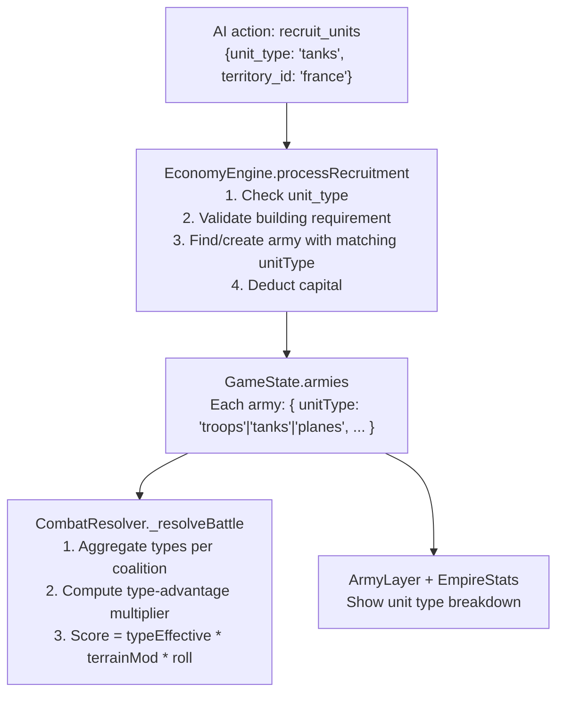

# RPS Combat System + Capital Decay

## Part 1: Capital Decay (Implemented)

**Capital decay above a threshold** — At the end of each economy turn, any capital exceeding `territories_owned * 10` decays by 20% ("corruption/bureaucratic waste"). An empire with 5 territories can bank 50 before losing any; an empire with 20 territories can bank 200. Stockpiling beyond that triggers automatic drain each turn.

Implementation: add to [`engine/EconomyEngine.js`](llm-empire-wars/engine/EconomyEngine.js) `updateEconomy` method, after the treasury update line. Also add to the AI prompt in [`ai/PromptBuilder.js`](llm-empire-wars/ai/PromptBuilder.js) so the AI knows about it and is motivated to spend.

```js
// Capital decay — corruption
const capitalCap = territories.length * 10;
if (empire.treasury > capitalCap) {
  const excess = empire.treasury - capitalCap;
  const decay = Math.ceil(excess * 0.2);
  empire.treasury -= decay;
  events.push({
    turn: state.meta.turn,
    type: 'capital_decay',
    description: `${empire.name} lost ${decay} capital to corruption (over cap of ${capitalCap})`,
    involvedEmpires: [empire.id],
  });
}
```

**Future capital sink ideas** (not implemented now, possible later):
- Elite unit upgrade action (12c for +30% combat bonus on one army)
- Diplomatic bribery (pay capital to reduce enemy reputation)
- One-time territory fortification (8c for single-turn defense boost)
- Logistics Depot building (10c, grants +1 army movement range)

---

## Part 2: RPS Combat System — Full Implementation Plan

### Design Overview

```
Tanks  → beat → Troops
Troops → beat → Planes
Planes → beat → Tanks
```

Type-advantage multiplier: **1.5x** applied to the unit category that counters the opponent's dominant type.

**All unit types require a building to recruit:**
- `barracks` (5 capital): unlocks troop recruitment. Starting territories receive one automatically; captured territories need one built first.
- `tank_factory` (15 capital): unlocks tank recruitment in that territory
- `airfield` (18 capital): unlocks plane recruitment in that territory

**Recruitment costs per unit type:**
- Troops: **3 capital/unit** (unchanged from current)
- Tanks: **5 capital/unit** (more expensive; strong against infantry)
- Planes: **6 capital/unit** (most expensive; counters armor)

This makes advanced units accessible to everyone but creates a real capital cost to field a mixed army, which synergizes with capital decay to ensure gold gets spent.

---

### Data Flow



---

### File-by-File Changes

`**[data/territories.js](llm-empire-wars/data/territories.js)**`

Add three entries to `BUILDING_DEFS` (lines 201–206):

```js
barracks:     { cost: 5,  label: 'Barracks',      effect: 'unlocks troop recruitment' },
tank_factory: { cost: 15, label: 'Tank Factory',   effect: 'unlocks tank recruitment' },
airfield:     { cost: 18, label: 'Airfield',       effect: 'unlocks plane recruitment' },
```

Also add a new export for per-unit-type recruitment costs:
```js
export const UNIT_COSTS = {
  troops: 3,
  tanks:  5,
  planes: 6,
};
```

---

`**[engine/GameState.js](llm-empire-wars/engine/GameState.js)`

- All empire starting armies (`armies[armyId] = { ... }`) get `unitType: 'troops'`
- Neutral garrison armies get `unitType: 'troops'`
- All starting territories have `buildings: { barracks: true }` auto-populated in `createInitialState`

---

`**[engine/SaveManager.js](llm-empire-wars/engine/SaveManager.js)*`\*

Bump `SAVE_VERSION` from `2` → `3`. In `migrateState`, add:

```js
if (record.version < 3) {
  for (const a of Object.values(gs.armies || {})) {
    if (!a.unitType) a.unitType = 'troops';
  }
  record.version = 3;
}
```

---

`**[engine/CombatResolver.js](llm-empire-wars/engine/CombatResolver.js)**`

Replace the current flat `totalSize * modifier * roll` with a type-aware calculation. New helper added to `_resolveBattle`:

```js
_getComposition(armies, stateArmies) {
  // returns { troops: N, tanks: N, planes: N }
}

_typeAwareScore(myComp, oppComp, modifier, roll) {
  // troops(1.5x if opp has planes) + tanks(1.5x if opp has troops) + planes(1.5x if opp has tanks)
  // all * modifier * roll
}
```

For multi-coalition (3+ empires) battles, compute score against the combined composition of all opposing coalitions.

Battle event descriptions gain flavor: _"Iron Throne's armored divisions overwhelmed Bosphorus Pact's infantry in France"_

---

`**[engine/EconomyEngine.js](llm-empire-wars/engine/EconomyEngine.js)`

In `processRecruitment`:

- Read `action.unit_type` (default `'troops'` if absent)
- Use `UNIT_COSTS[unitType]` for per-unit capital cost (3 for troops, 5 for tanks, 6 for planes) instead of the current hardcoded `amount * 3`
- Validate building requirement: `troops` → `territory.buildings?.barracks`, `tanks` → `territory.buildings?.tank_factory`, `planes` → `territory.buildings?.airfield`
- When finding/creating the target army, match on `empireId + locationId + unitType` so troops and tanks don't merge into the same army object

Mercenaries always default to `unitType: 'troops'` (no advanced unit mercs).

---

`**[ai/ResponseParser.js](llm-empire-wars/ai/ResponseParser.js)*`\*

- `ACTION_SCHEMA.recruit_units` stays `required: ['territory_id', 'amount']`; `unit_type` is optional
- In `_validateAction` for `recruit_units`: if `unit_type` present, validate it is one of `'troops'|'tanks'|'planes'`
- In `_coerceRecruit`: preserve `unit_type` field; default to `'troops'` if absent

---

`**[ai/PromptBuilder.js](llm-empire-wars/ai/PromptBuilder.js)**`

System prompt additions (after the ECONOMY section):

```
MILITARY UNIT TYPES — ROCK PAPER SCISSORS:
- TROOPS (infantry): 3 capital/unit. Requires Barracks (5c). BEATS PLANES. Weak vs Tanks.
- TANKS (armor): 5 capital/unit. Requires Tank Factory (15c). BEATS TROOPS. Weak vs Planes.
- PLANES (air force): 6 capital/unit. Requires Airfield (18c). BEATS TANKS. Weak vs Troops.
Counter-unit advantage: 1.5x combat multiplier when your units counter the enemy's.
Use "unit_type": "troops"|"tanks"|"planes" in recruit_units actions.

CAPITAL DECAY: Treasury above (territories_owned * 10) loses 20% of the excess each turn to corruption. Spend or lose it!
```

User prompt additions:

- Army listing shows type: `army_id: 5 TROOPS in France (can move to...)`
- Territory listing shows available recruitment: `France: [Has: Barracks, Tank Factory] → can recruit troops, tanks`
- Territories without required buildings flagged: `[No airfield — planes unavailable here]`

---

`**[ui/EmpireStats.js](llm-empire-wars/ui/EmpireStats.js)**`

Replace `totalUnits` with a typed breakdown in the `update` method:

```
15 units (9 inf / 4 arm / 2 air)
```

Computed by summing `army.size` grouped by `army.unitType` across all empire armies.

---

`**[map/ArmyLayer.js](llm-empire-wars/map/ArmyLayer.js)**`

Each army already renders as a separate marker. Add `unit-${army.unitType}` as a CSS class to the marker div:

```html
<div class="army-marker unit-troops" style="background: ${color}">5</div>
<div class="army-marker unit-tanks" style="background: ${color}">3</div>
```

Add CSS rules in `style.css` for each type — e.g., a small icon badge or border-style difference (dashed for planes, double for tanks) so unit types are visually distinguishable without changing marker size.
